<div align="center">

  ###  

  ***FRAVE DEVELOPER***
</div>

<div align="center">
  E-COMMERCE APP PRODUCTS
</div>

<br>
<table align="center">
    <tr>
        <th style="text-align:center">
            <a href="https://cutt.ly/pckBg9D">
                
            </a>
        </th>
        <th style="text-align:center">
            <a href="https://www.instagram.com/frave_developer">
                
            </a>
        </th>
        <th style="text-align:center">
            <a href="#">
                
            </a>
        </th>
    </tr>
</table>
<br>

___
## Branch Mongodb -> Support Database MongoDB

## FIRST
```
    flutter clean
```
## SECOND
```
    flutter pub get
```

## Video Yotube

[Flutter Ecommerce Full App](https://youtu.be/zg6_GxQwDx0)


## Donate

<a href="https://www.buymeacoffee.com/frave"></a>
<a href="https://www.paypal.me/Fpereza"></a>
<a>[](https://ko-fi.com/I3I1C3R4S)</a>

## [Code Backend](https://github.com/Frave07/Backend-E_commerce-Products-NodeJs)

___

## Screenshot

<table border>
    <tr>
        <th style="text-align:center">Splash Screen</th>
        <th style="text-align:center">Presentation Screen</th>
        <th style="text-align:center">Register Screen</th>
    </tr>
    <tr>
        <td></td>
        <td></td>
        <td>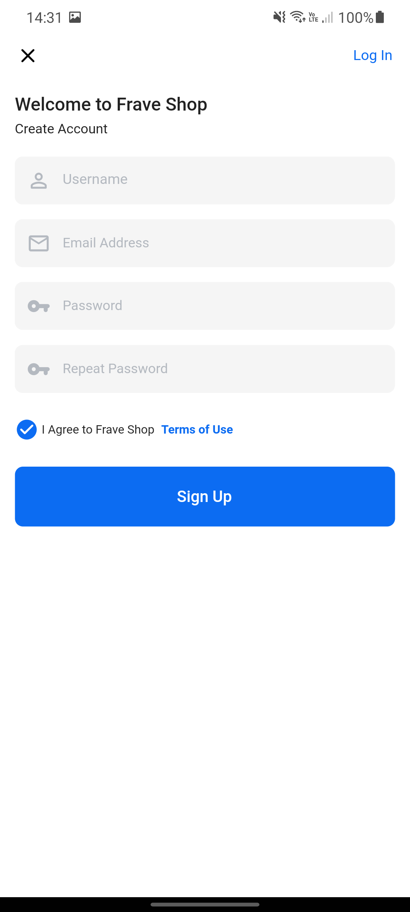</td>
    <tr>
</table>

<table border>
    <tr>
        <th style="text-align:center">Login Screen</th>
        <th style="text-align:center">Home Screen</th>
        <th style="text-align:center">Account Screen</th>
    </tr>
    <tr>
        <td></td>
        <td>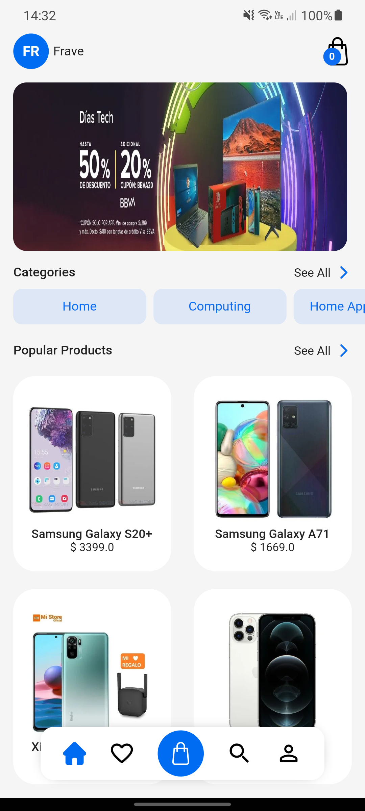</td>
        <td></td>
    <tr>
</table>

<table border>
    <tr>
        <th style="text-align:center">Products Screen</th>
        <th style="text-align:center">Details Products Screen</th>
        <th style="text-align:center">Cart Screen</th>
    </tr>
    <tr>
        <td>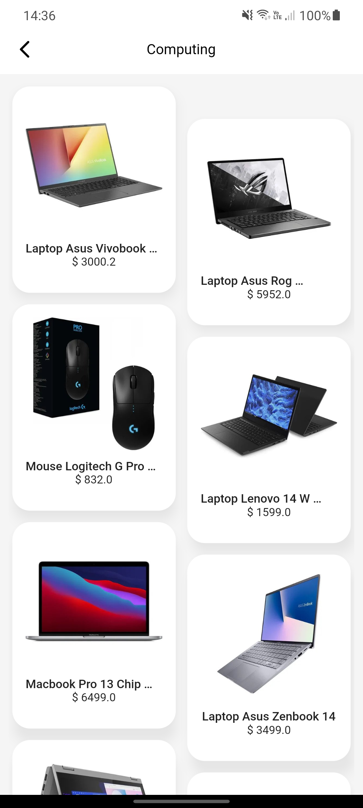</td>
        <td>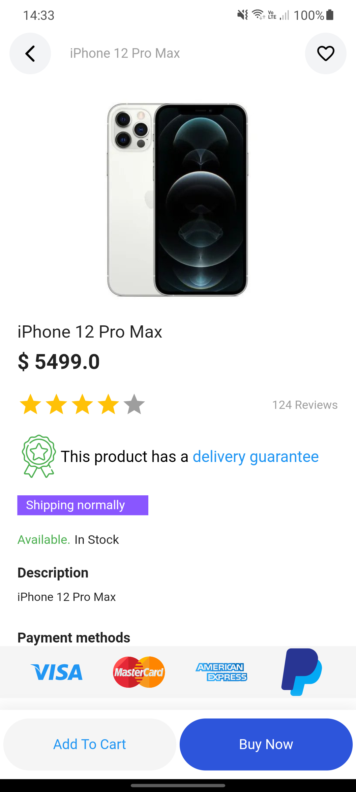</td>
        <td>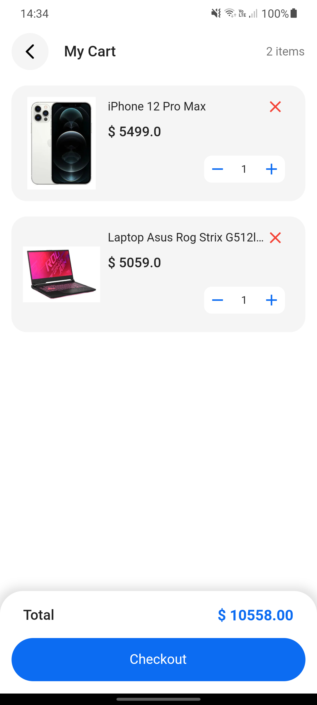</td>
    <tr>
</table>

<table border>
    <tr>
        <th style="text-align:center">Ckeckout Screen</th>
        <th style="text-align:center">Add Street Address Screen</th>
        <th style="text-align:center">Add Credit card Screen</th>
    </tr>
    <tr>
        <td>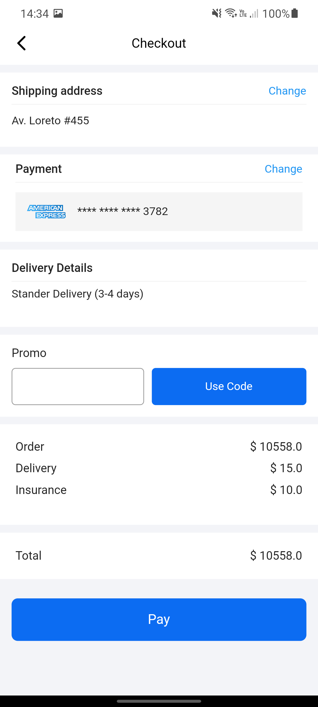</td>
        <td>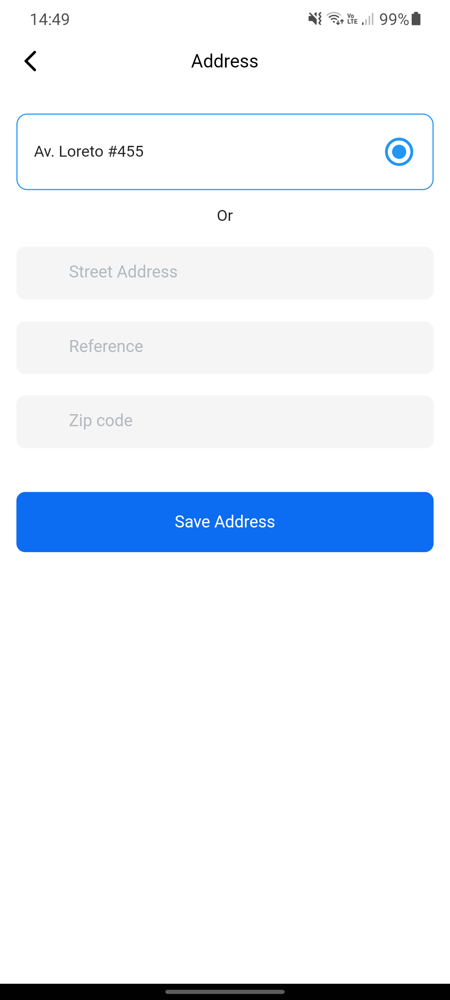</td>
        <td></td>
    <tr>
</table>

<table border>
    <tr>
        <th style="text-align:center">Profile Screen</th>
        <th style="text-align:center">Favorite Screen</th>
        <th style="text-align:center">My Shopping Screen</th>
    </tr>
    <tr>
        <td></td>
        <td>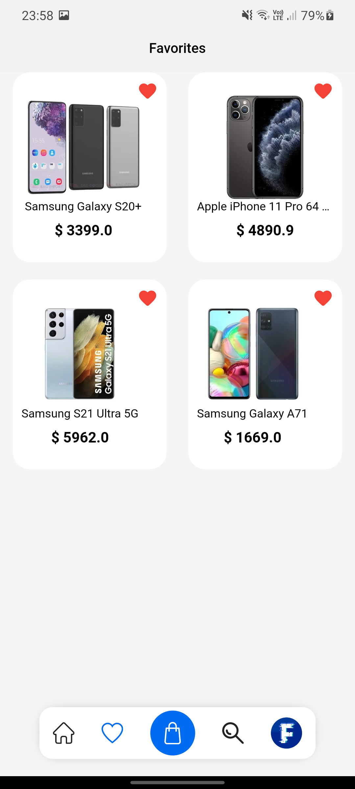</td>
        <td>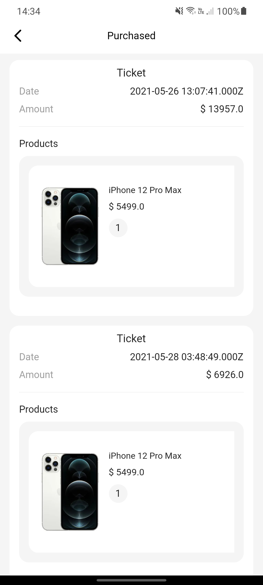</td>
    <tr>
</table>

<table border>
    <tr>
        <th style="text-align:center">Category Screen</th>
        <th style="text-align:center">Add New Product</th>
    </tr>
    <tr>
        <td>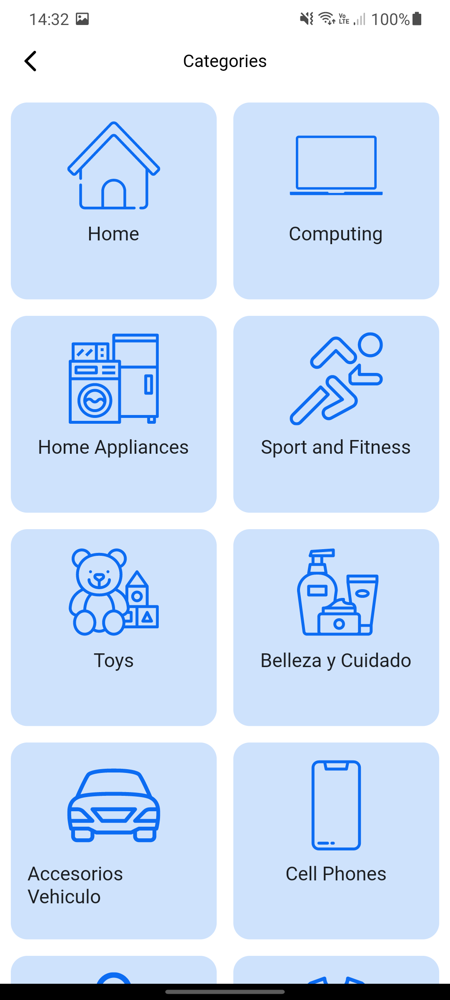</td>
        <td>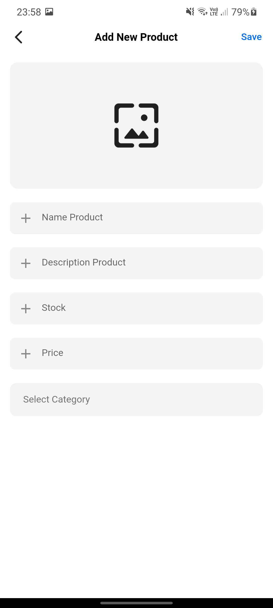</td>
    <tr>
</table>


