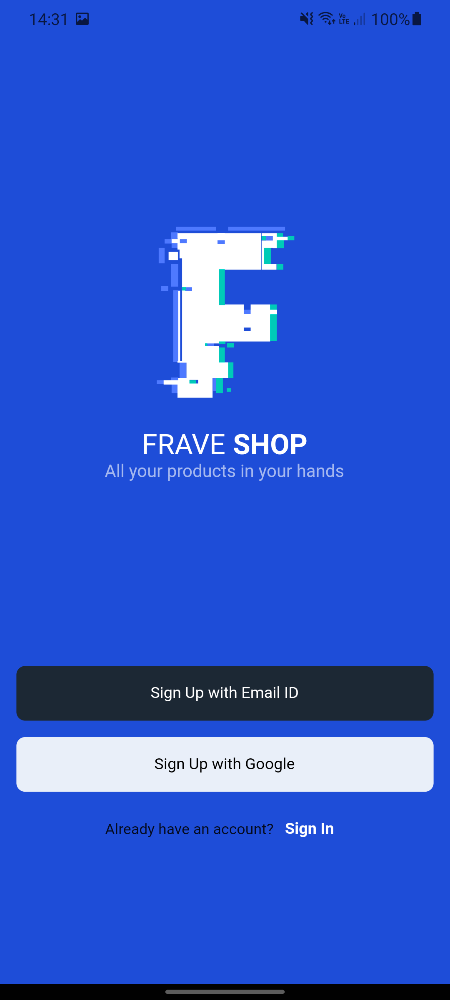
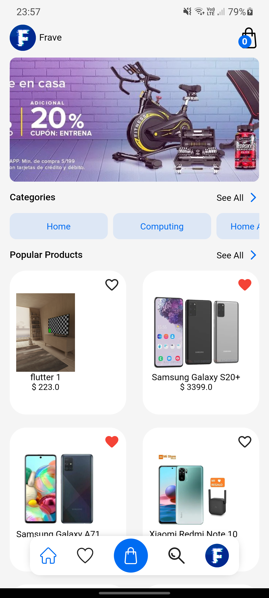
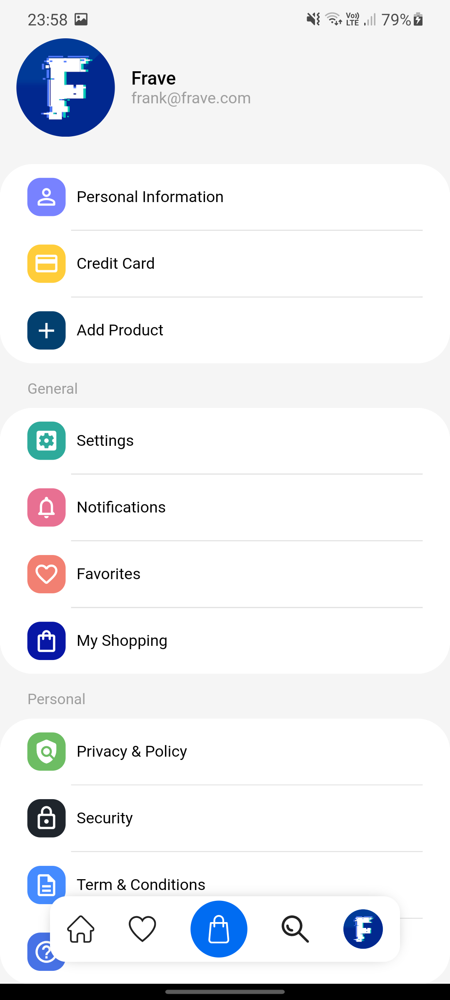
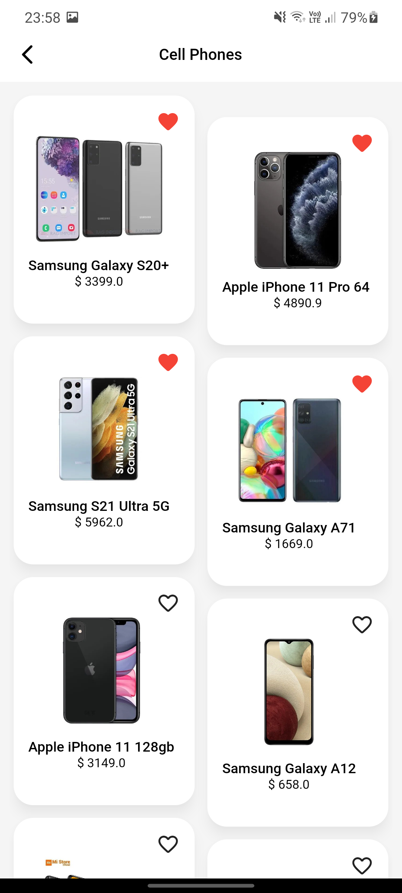
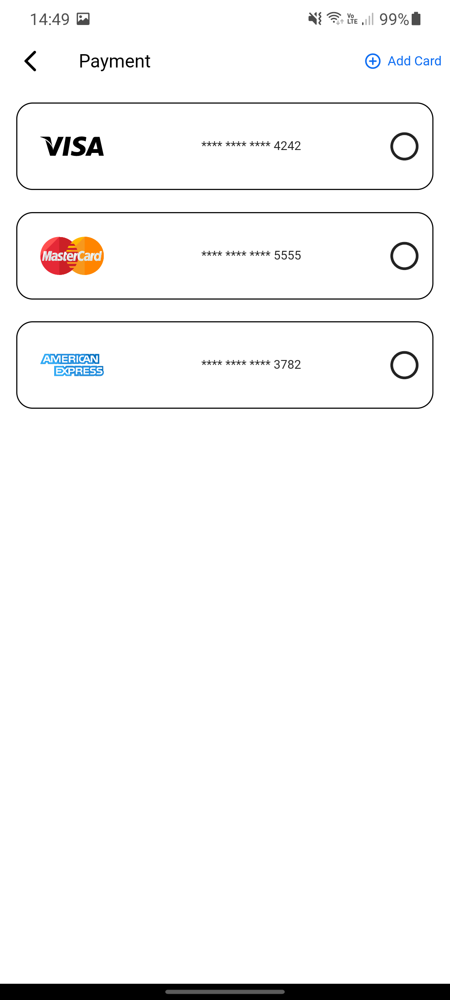
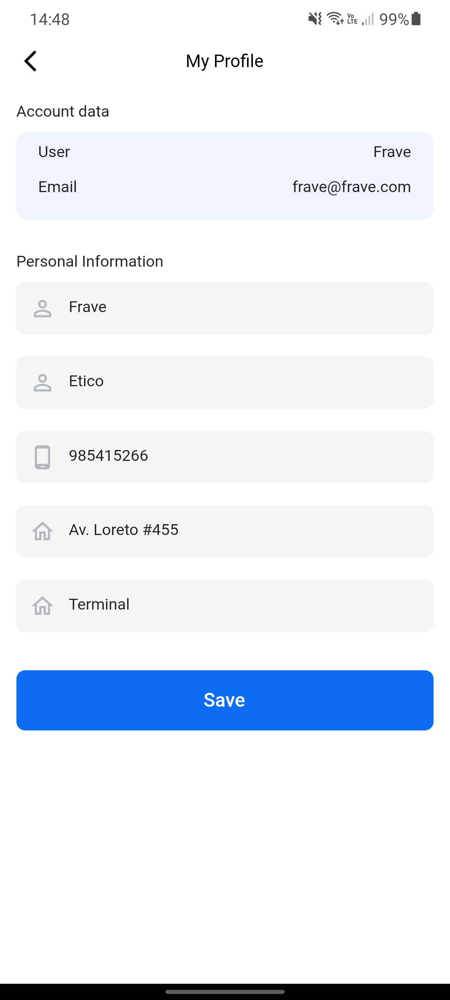

# E-COMMERCE APP PRODUCTS | FRAVE DEVELOPER

## Flutter Project

- Flutter Bloc | Splash Screen | Stripe Payment

## Flutter App - Flutter Bloc | Splash Screen | Stripe Payment
___
## Branch Mongodb -> Support Database MongoDB

### Yotube Channel

[Frave Developer](https://www.youtube.com/channel/UCkNYlmbx487MPmYvfSMAdRg)

### Video Yotube

[Flutter Ecommerce Full App](https://youtu.be/zg6_GxQwDx0)

### Social Media

### Donate

<a></a>

## Backend

- [Backend Link](https://github.com/Frave07/Backend-E_commerce-Products-NodeJs)

___

## Screenshot

<table border>
    <tr>
        <th style="text-align:center">Splash Screen</th>
        <th style="text-align:center">Presentation Screen</th>
        <th style="text-align:center">Register Screen</th>
    </tr>
    <tr>
        <td></td>
        <td></td>
        <td></td>
    <tr>
</table>

<table border>
    <tr>
        <th style="text-align:center">Login Screen</th>
        <th style="text-align:center">Home Screen</th>
        <th style="text-align:center">Account Screen</th>
    </tr>
    <tr>
        <td></td>
        <td></td>
        <td></td>
    <tr>
</table>

<table border>
    <tr>
        <th style="text-align:center">Products Screen</th>
        <th style="text-align:center">Details Products Screen</th>
        <th style="text-align:center">Cart Screen</th>
    </tr>
    <tr>
        <td></td>
        <td></td>
        <td></td>
    <tr>
</table>

<table border>
    <tr>
        <th style="text-align:center">Ckeckout Screen</th>
        <th style="text-align:center">Add Street Address Screen</th>
        <th style="text-align:center">Add Credit card Screen</th>
    </tr>
    <tr>
        <td></td>
        <td></td>
        <td></td>
    <tr>
</table>

<table border>
    <tr>
        <th style="text-align:center">Profile Screen</th>
        <th style="text-align:center">Favorite Screen</th>
        <th style="text-align:center">My Shopping Screen</th>
    </tr>
    <tr>
        <td></td>
        <td></td>
        <td></td>
    <tr>
</table>

<table border>
    <tr>
        <th style="text-align:center">Category Screen</th>
        <th style="text-align:center">Add New Product</th>
    </tr>
    <tr>
        <td></td>
        <td></td>
    <tr>
</table>

